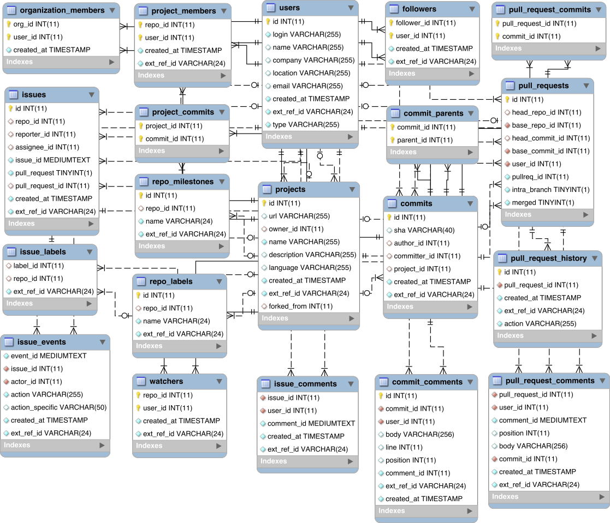

[Download](files/schema.png) [Download PDF](files/schema.pdf)

## Entities and their relationships

#### users
Github users.

* A user has a unique user name or email. May contain artificially generated user names, see [commits](relational.html#commits) below.
* There are two `type`s of users, `USER`s and `ORG`anizations.
  * Users can be *real* or *fake*. Real users can own projects and perform
 actions such as open issues, create pull requests and push commits. Fake
 users only appear as authors or committers of commits. Fake users are marked
 by the `fake` field.
  * Organizations are meta users that point to a collection of users. The members of organizations can be found in `organization_members`. Organization users can only own projects and they do not perform any other actions.
* Users may be marked as `deleted`. This means that the user was once active on
GitHub but GHTorrent can no longer get his/her details.

*Update Nov 2015:* User entries are now geocoded. The location field remains
intact, while 5 fields have been added with information about the
geographic location of the user. The Open Street Maps API has been used
to do the mapping of the location field to the user's geocode. As a result,
the state and city fields are stored in the local language of the geocoded
area. Also, many users do not report their location or their location
is field in with random information; in those cases, no geocoding information
is available.


--- See where most commits are commit from today
select u.country_code, count(*)
from commits c, users u
where c.author_id = u.id
and date(c.created_at) = date(now())
group by u.country_code


*Update Mar 2016:* User personal data (emails and real names) are excluded
from the downloaded dump, while configuration dissalows access to those
fields for the online access services for the MySQL database.

#### organization\_members
Users that are members of an organization.

* The `created_at` field is only filled in accurately for memberships for which
GHTorrent has recorded a corresponding event. Otherwise, it is filled in with the
latest date that the corresponding user or organization has been created.

*Update Nov 2015:* Organizations can now select wheather membership information
is revealed to external parties. This means that information about this
table can no longer be accurate.

#### projects
Information about repositories. A repository is always owned by a user.

* The `forked_from` field is empty unless the
project is a fork in which case it contains the `id` of the project the project
is forked from.

* The `deleted` field means that the project has been deleted from Github.

* The `updated_at` field indicates when the last full update was done for
this project.

#### project\_members
Users that have commit access to the repository.

The `created_at` field is only filled in accurately for memberships for which
GHTorrent has recorded a corresponding event. Otherwise, it is filled in with the
latest date that the corresponding user or project has been created.

*Update Nov 2014:* GitHub has disabled the API end point used to retrieve
members to an organization. GHTorrent uses the `MemberEvent` event to
approximate memberships, but this is not always accurate. You are thus advised
to use heuristics (e.g. the  committers + mergers of pull) to calculate membership,
such as the following:


--- Get active core team participants for the last 3 months
select distinct(u.login) as login
    from commits c, users u, project_commits pc, users u1, projects p
    where u.id = c.committer_id
      and u.fake is false
      and pc.commit_id = c.id
      and pc.project_id = p.id
      and p.owner_id = u1.id
      and p.name = 'rails'
      and u1.login = 'rails'
      and c.created_at > DATE_SUB(NOW(), INTERVAL 3 MONTH)
union
select distinct(u.login) as login
  from pull_requests pr, projects p, users u, users u1, pull_request_history prh
  where u.id = prh.actor_id
    and prh.action = 'merged'
    and u1.id = p.owner_id
    and prh.pull_request_id = pr.id
    and pr.base_repo_id = p.id
    and prh.created_at > DATE_SUB(NOW(), INTERVAL 3 MONTH)
    and p.name = 'rails'
    and u1.login = 'rails'


### project\_languages
Languages that are used in the repository along with **byte counts** for
all files in those languages.

Multiple entries can exist per project. The `created_at` field is filled in with
the latest timestamp the query for a specific `project_id` was done.

The table is filled in when the project has been first inserted on when
an update round for all projects is made.


-- Get the latest byte count for languges in Ruby on Rails
select *
from project_languages
where project_id = 1334
order by created_at desc



#### commits
Unique commits.

* Each commit is identified globally through its `sha` field. If the author or
the committer has not configured his [Github email address](https://help.github.com/articles/setting-your-email-in-git), no resolution to
a `user` entry is possible. In that case, GHTorrent generates artificial users using the provided email in the Git commit author or committer fields. If the user
then configures his Github account, GHTorrent will update the artificial user
accordingly. 

* The `project_id` field contains a link to the project that this commit has
been first associated with. This might not be the project this commit was
initially pushed to, e.g. in case the fork is processed before the parent.
See [project\_commits](relational.html#project_commits).

* The `project_id` field may be null when the repository has been
deleted at the time the commit is processed. This situation might happen when
retrospectively processing pull requests for a repository and the 
repository which the pull request originates from has been deleted.

#### commit\_parents
The parent commit(s) for each commit, as specified by Git.

#### project\_commits
The commits belonging to the history of a project.

More than one projects can share the same commits if one is a fork of the other.

#### commit\_comments
Code review comments on commits.

These are comments on individual commits. If a commit is associated with a pull
request, then its comments are in the
[pull\_request\_comments](relational.html#pull_request_comments) table.

#### followers
A follower to a user.

The `created_at` field is only filled in accurately for followships for which
GHTorrent has recorded a corresponding event. Otherwise, it is filled in with the
latest date that the corresponding user or follower has been created.

#### watchers
Users that have starred (was [watched](https://github.com/blog/1204-notifications-stars)) a project

The `created_at` field is only filled in accurately for starrings for which
GHTorrent has recorded a corresponding event. Otherwise, it is filled in with the
latest date that the corresponding user or project has been created.

#### pull\_requests
A pull request initiated from `head_repo_id`:`head_commit_id` to `base_repo_id`:`base_commit_id`

* Pull requests can be in various states. The states and their transitions
are recorded in the [pull\_request\_history](relational.html#pull_request_history) table.
* The `pullreq_id` field is Github's pull request unique identifier
* The `intra_branch` field signifies that the head and base repositories are the
same
* If the head repository is NULL, this means that the corresponding project had been deleted when GHTorrent processed the pull request.

#### pull\_request\_history
An event in the pull request lifetime

The `action` field can take the following values

* `opened`: When the pull request has been opened
* `closed`: When the pull request has been closed
* `merged`: When Github detected that the pull request has been merged. No merges
outside Github (i.e. Git based) are reported
* `reoponed`: When a pull request is opened after being closed
* `syncrhonize`: When new commits are added/removed to the head repository

#### pull\_request\_commits
A commit associated with a pull request

The list is additive. This means if a rebase with commit squashing takes place after the commits of a pull request have been processed, the old commits will not be deleted.

#### pull\_request\_comments
A code review comment on a commit associated with a pull request

The list is additive. If commits are squashed on the head repo, the comments
remain intact.

#### issues
An issue associated with a repository

* The `assignee` field is filed in with the user to which the issue was
assigned at the time the issue was processed.
* Issues have history recorded in the [issue\_events](relational.html#issue_events) table.
* For every pull request, GHTorrent creates a corresponding issue. The
`pull_request_id` field points to the associated pull request
* The `issue_id` field is the unique identifier given to the issue by Github.

#### issue\_events
An event on an issue

* The `action` field can have the following values: 
  * `subscribed`: When a user subscribes to receive notifications about the issue.
  * `mentioned`: When a user is mentioned by another user (@user notation)
  * `closed`: When the issue has been closed
  * `referenced`: The issue was referenced in a commit (using the 
   [fixes: conventions](https://github.com/blog/831-issues-2-0-the-next-generation))
  * `assigned`: When the issue has been assigned to an actor.
  * `reopened`: When a closed issue is reopened
  * `unsubscribed`: When a user unsubscribed from issue.
  * `merged`: When the pull request pointed by the issue has been merged.
  * `head_ref_cleaned`:  (Not documented) ?
  * `head_ref_deleted`: (Not documented) When the branch of the head repository has been deleted
  * `head_ref_restored`: (Not documented) When the head repository of a pull
  request has been restored (using the restore branch functionality).

* The `action_specific` field gets filled in with the `commit\_id` of the last
commit when a pull request has been closed, merged or referenced.

#### issue\_comments
An entry to the issue discussion. This table is always filled in with pull
request (or issue) discussion comments, irrespective of whether the repository
has issues enabled or not.

#### repo\_labels
A label to be assigned to an issue affecting this repository.

#### issue\_labels
A label that has been assigned to an issue

## Example queries

#### List commits for a repository


select c.*
from commits c, project_commits pc, projects p, users u
where u.login = 'rails'
  and p.name = 'rails'
  and p.id = pc.project_id
  and c.id = pc.commit_id
order by c.created_at desc


#### Get all actions for a pull request


select user, action, created_at from
(
  select prh.action as action, prh.created_at as created_at, u.login as user
  from pull_request_history prh, users u
  where prh.pull_request_id = ?
    and prh.actor_id = u.id
  union
  select ie.action as action, ie.created_at as created_at, u.login as user
  from issues i, issue_events ie, users u
  where ie.issue_id = i.id
    and i.pull_request_id = ?
    and ie.actor_id = u.id
  union
  select 'discussed' as action, ic.created_at as created_at, u.login as user
  from issues i, issue_comments ic, users u
  where ic.issue_id = i.id
    and u.id = ic.user_id
    and i.pull_request_id = ?
  union
  select 'reviewed' as action, prc.created_at as created_at, u.login as user
  from pull_request_comments prc, users u
  where prc.user_id = u.id
    and prc.pull_request_id = ?
) as actions
order by created_at;


#### Get participants in an issue or pull request


select distinct(user_id) from
(
  select user_id
  from pull_request_comments
  where pull_request_id = ?
  union
  select user_id
  from issue_comments ic, issues i
  where i.id = ic.issue_id and i.pull_request_id = ?
) as participants


#### Get all users in NL that committed to a Java project today


select u.login
from users u, commits c, projects p, project_commits pc
where date(c.created_at) = date(now())
and pc.commit_id = c.id
and c.author_id = u.id
and u.country_code = 'nl'
and 'java' = (select pl.language
              from project_langauges pl
              where pl.project_id = p.id
              order by pl.created_at desc, pl.bytes desc
              limit 1)


